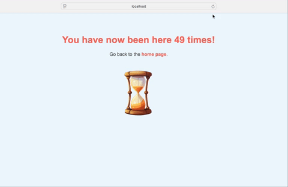

<h1 align="center">Flask & Redis - Multi container application</h1>

  

## Objective
The goal is to create a **multi-container application** that consists of a simple **Python Flask web application** and a **Redis database**. The Flask application will interact with Redis to store and retrieve a visit count.

## Requirements

### **Flask Web Application**
- A Flask app with two routes:
  - `/`: Displays a simple welcome message.
  - `/count`: Increments and displays a visit count stored in Redis.

### **Redis Database**
- Use **Redis** as a key-value store to track the visit count.

### **Dockerize Both Services**
- **Flask App**: Dockerize the Flask web application using a `Dockerfile`.
- **Redis**: Use the official Redis image and configure it with a `Dockerfile`.
- Use **Docker Compose** to orchestrate both the Flask and Redis containers.

